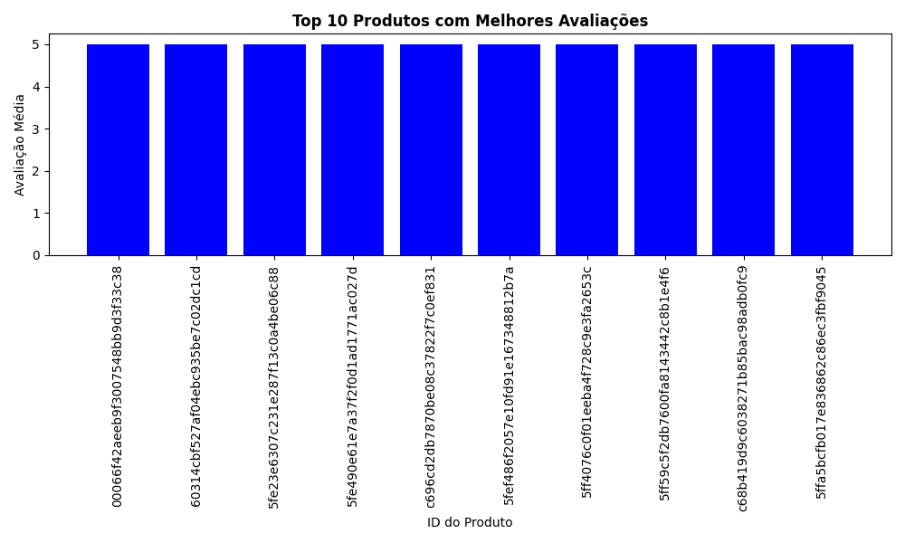

# Desafio de Dados Talent Lab

## Análise de Dados do E-Commerce Brasileiro 
Este desafio visa fornecer uma análise abrangente do desempenho, logística, satisfação do cliente, finanças e marketing do setor de comércio eletrônico brasileiro. Utilizando conjuntos de dados do Olist, exploramos várias facetas do comércio eletrônico, desde a análise de vendas até a satisfação do cliente e a eficácia do marketing.

#### Ferramentas Utilizadas
##### Python
Bibliotecas: Pandas, Matplotlib, NumPy, SciPy, Seaborn

## 1. Análise de Performance de Vendas
a. Volume de Vendas por Categoria:  Identificar quais categorias de produtos têm o 
maior volume de vendas e em quais períodos (mensal, trimestral).

##### Identifiquei as categorias de produtos com o maior volume de vendas e analisei essas tendências ao longo do tempo, tanto em uma base mensal quanto trimestral.

#### Resultados Obtidos
Observei que as categorias de produtos mais vendidas variam ao longo do tempo.

Por meio de visualizações gráficas, como gráficos de barras mensais e trimestrais, destaquei as tendências de vendas para as 10 principais categorias.

## 2. Análise de Logística
a. Prazos de Entrega: Calcular o tempo médio de entrega e identificar os fatores que 
influenciam atrasos nas entregas.

##### Calculei o tempo médio de entrega e identificamos atrasos nas entregas para entender a eficácia do processo logístico.

'''bash

Detalhes dos pedidos com atraso em Roraima:
------------------------------------------------------------
                               order_id                       customer_id  ... customer_city customer_state
25858  cdde87555bcd91df4fa4f191cbc77774  84874c595637bb7aea0323c01a7e9c92  ...     boa vista             RR
73288  a65211639143a90d6cb4116d808b1823  b23f056c8604016df9fefaa92128ab42  ...     boa vista             RR
74759  2fa29503f2ebd9f53deba187160f3202  5c42637f3e7e7c520282ae5c4faab832  ...     boa vista             RR
83633  3a9e44b449e2ec9986a329724bc824eb  8e46c55f2293dfb57e5e70080db74fe9  ...     boa vista             RR
96279  a72fc5669df669ab2c501cd323698fac  05ad4097a892d5d8163107dd0bc3ca2d  ...     boa vista             RR

#### Resultados Obtidos
Além de obter o resultado do tempo médio de entrega, busquei analisar o tempo médio de entrega por estado para identificar discrepâncias regionais. A minha lógica era entender em quais Estados havia mais demora na entrega dos produtos e, a partir disso, identificar os fatores de atraso para aquela região. 

#### Identificação de Fatores de Atrasos
Identifiqui atrasos em várias entregas para clientes localizados em Roraima. Os atrasos variaram entre algumas semanas a cerca de um mês além da data estimada de entrega. Esses atrasos podem ter sido causados por uma variedade de fatores, como questões logísticas ou geográficas. Esses insights destacam a importância de monitorar de perto os prazos de entrega e identificar áreas de melhoria para garantir uma experiência satisfatória do cliente.

## 3. Análise de Satisfação do Cliente
a. Avaliações de Produtos: Analisar a distribuição das avaliações dos produtos e 
identificar os produtos com as melhores e piores avaliações.

##### Analisei a distribuição das avaliações dos produtos e identifiquei os produtos com as melhores e piores avaliações.

#### Resultados Obtidos
Calculei  a média das avaliações para cada produto e classificamos os produtos com base nessas médias.

Destaquei os 10 principais produtos com as melhores e piores avaliações, acompanhados de visualizações gráficas.

## 4. Análise Financeira
a. Análise de Lucratividade por Categoria: Calcular a lucratividade de diferentes 
categorias de produtos, levando em conta o custo dos produtos e o preço de venda.

##### Calculei a lucratividade de diferentes categorias de produtos, considerando o custo dos produtos e o preço de venda.

#### Resultados Obtidos
Essa análise revelou insights valiosos sobre a lucratividade por categoria de produto. Identifiquei que várias categorias apresentam lucratividade negativa, incluindo Seguros e Serviços, Casa Conforto 2, Fashion Roupa Infanto-Juvenil, CDs/DVDs Musicais, Flores, Fraldas/Higiene, PC Gamer, Artes e Artesanato, Fashion Esporte e La Cuisine. Esses resultados destacam a necessidade de revisão das estratégias de precificação e controle de custos nessas categorias para melhorar a rentabilidade e garantir a saúde financeira do negócio. 

## 5. Análise de Marketing
a. Análise de Conversão de Vendas: Estudar a taxa de conversão de vendas com base 
em diferentes fontes de tráfego (orgânico, pago, social, etc.).

##### Verifiquei a taxa de conversão de vendas com base em diferentes fontes de tráfego, como orgânico, pago, social, etc.

#### Resultados Obtidos
Destaquei a taxa de conversão de vendas por tipo de pagamento. Os resultados revelaram que o cartão de crédito lidera com uma taxa de conversão de 74.0%, seguido pelo boleto com 19.0%, voucher com 5.5% e cartão de débito com 1.5%. Esses dados demonstram a eficácia de cada forma de pagamento na conversão de vendas concluídas. O cartão de crédito se destaca com a maior taxa de conversão, enquanto o cartão de débito possui a menor, apontando áreas potenciais para melhorias ou ajustes nas estratégias de pagamento.

